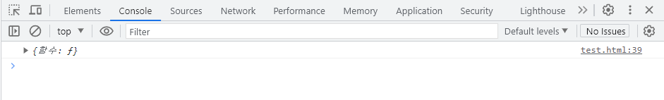

# 😮 03.arrow function

ES6 문법 이후로 등장 한 arrow function은 함수를 만들수 있는 새로운 문법이다.

```javascript
    
    // 함수를 만드는 방법 1
    function 함수(){}
    
    // 함수를 만드는 방법 2
    var 함수 = function(){}


    // arrow function
    var dev = (a) => {
            return a + 10
        }
    dev();
```


### 🙂 arrow function을 쓰는이유

#### ☝️첫번째 이유&#x20;


먼저 함수를 만드는 이유는

1. 여러가지 기능을 하는 코드를 한 단어로 묶고 싶을 때 (그리고 나중에 재사용할 때)
2. 입출력기능을 만들 때&#x20;

<mark style="color:green;">**arrow function을 사용하면 입출력기능을 직관적으로 잘 표현해 준다.**</mark>


#### ✌️두번째  이유

<mark style="color:green;">**소, 중괄호 생략이 가능해 진다.**</mark>

```javascript
var dev = a => {return a + 10}
dev();
```

파라미터가 하나라면 소괄호 생략이 가능해진다


```javascript
var dev = a => return a + 10;
```

중괄호 안에 return 한줄 뿐일때는 중괄호도 생략가능하다.


#### ✌세번째  이유

<mark style="color:green;">**arrow function을 쓰면 내부에서 this값을 쓸 때 밖에 있던 this값을 그대로 사용합니다.**</mark>


함수가 쓰인 위치에 따라 this값이 변한다.

하지만 arrow function은 어디서 쓰이던 내부의 this값을 변화시키지 않는다.

바깥에 있던 this의 의미 그대로 내부에서도 사용하는 함수가 arrow function이라는 함수이다.


```javascript
    var obj = {
            함수 : function(){
                console.log(this)
            }
        }
    obj.함수();
```

<figure><figcaption><p>일반 함수 에서의 this</p></figcaption></figure>

일반 함수에서의 this는 함수()를 가지고 있는 오브젝트인 `obj` 가 콘솔창에 출력된다.


```javascript
    var obj = {
        함수 : () => {
            console.log(this)
        }
    } 
    obj.함수()
```

<figure><figcaption><p>arrow function 에서의 this</p></figcaption></figure>

이 오브젝트의  arrow function 안에서 this는 `window`가 출력된다.

왜 함수의 주인인 오브젝트1이 출력되지 않냐면..

this값은 함수를 만나면 항상 변하는데 arrow function 안에서는 변하지 않고&#x20;

밖에 있던 this를 그대로 쓰기 떄문이다.

(오브젝트 밖에 있던 this는 window) &#x20;


#### ☝️일반  function과 arrow function의 용도가 완전히 같지는 않기 때문에 주의해서 사용해야한다
